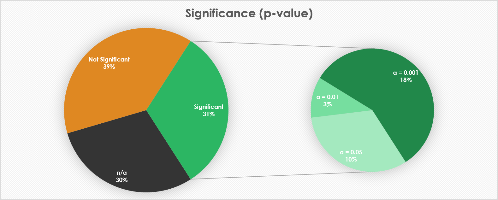
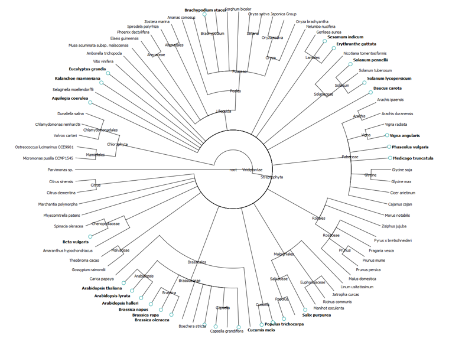
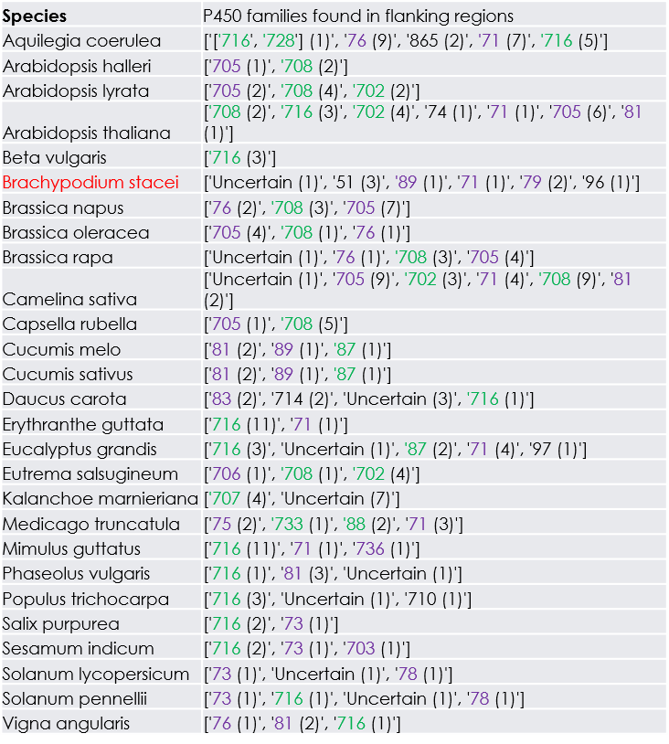

# OSC-P450-Investigation
A brief description of my internship in 2018 along with some sample code.

# Background
Oxidosqualene cyclases (OSCs) are a class of terpenoid synthase (TS) enzymes catalysing cyclization of 2,3-oxidosqualene into various triterpenoids which then undergo various modifications including P450-catalysed oxidation.

Due to their functional relationship and the existence of biosynthetic gene clusters (BGCs) we would expect co-localisation mechanisms of OSC/P450 gene pairs at play.

# Aims

* Examine the distributions of various gene families across a wide number of genomes (88).
* Investigate which of these genes are significantly clustered around OSCs and, in the case of P450s, whether certain CYP families are more likely to be found in the vicinity of an OSC.
* Consider whether this clustering is more likely in certain clades.

# Methods

* 88 genomes were selected (the best annotated .gbk files) and ran through HMMER to record the location and number of important genes.
* We then searched within a 20 gene neighbourhood (10 upstream/downstream) about each OSC and recorded genes of interest.
* Furthermore, the P450s were ran through a CD-HIT CYP classifier to classify them into their appropriate families.
* Statistical tests were then performed to determine significance of results.

# Results

* Unfortunately only 31% appeared to be significant, but a large amount (30%) were not well annotated enough to be able to make a conclusion.

* Interestingly, the mustard family (Brassicaceae) had a high proportion of significant genomes.

* Of those genomes that were significant, OSC genes were found overwhelmingly in pairings with CYP71 clan and CYP85 clan (particularly CYP716 family) genes (clans are David Nelson’s classifications).

# Code

A few Python scripts have been included to give a rough idea of some of the code.
